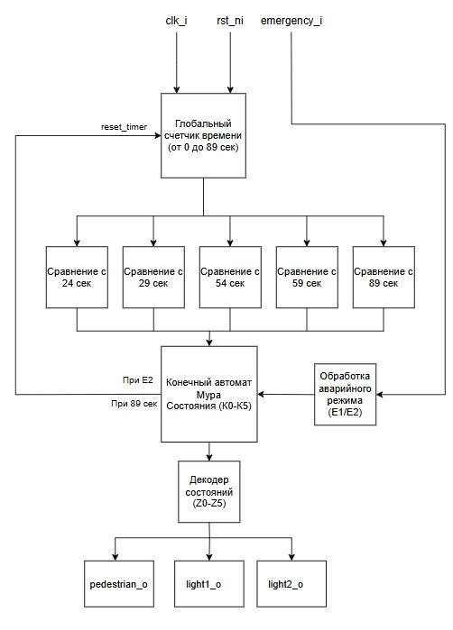
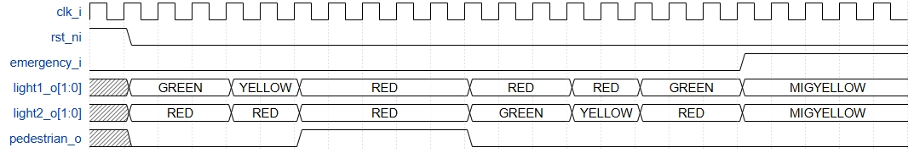
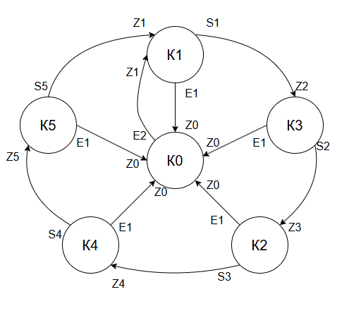

# Traffic Light Controller

Контроллер светофора для управления двумя дорожными светофорами и пешеходным переходом.

## Описание модуля

### Модуль контроллера светофора

```verilog
module traffic_light_controller (
    input  logic clk_i,
    input  logic rst_ni,
    input  logic emergency_i,
    output logic [1:0] light1_o,
    output logic [1:0] light2_o,
    output logic pedestrian_o
);

endmodule
```

### Входные данные

- clk_i - тактовый сигнал.

- rst_ni - сигнал асинхронного сброса.

- emergency_i - сигнал режима "не работает".


### Выходные данные

- light1_o[1:0] - сигналы для светофора 1. В случае, если значение равно 00, то горит красный сигнал; если 01 - желтый сигнал; если 10 - зеленый сигнал; если 11 - мигающий желтый сигнал.

- light2_o[1:0] - сигналы для светофора 2. В случае, если значение равно 00, то горит красный сигнал; если 01 - желтый сигнал; если 10 - зеленый сигнал; если 11 - мигающий желтый сигнал.

- pedestrian_o - сигнал для пешеходного перехода. В случае, если значение равно 0, то горит красный сигнал для пешеходов; если 1 - зеленый сигнал для пешеходов.

### Принцип работы

Контроллер реализован как конечный автомат типа Мура — тип автомата, в котором все выходные сигналы определяются исключительно текущим состоянием, без учёта входных сигналов (за исключением аварийного режима). Это обеспечивает стабильную и предсказуемую работу системы.

Контроллер управляет двумя дорожными светофорами и одним пешеходным сигналом. Работа системы построена по циклическому принципу: сначала каждой из двух полос по очереди предоставляется зелёный свет с последующим жёлтым сигналом, после чего активируется пешеходный переход. Контроллер повторяет этот цикл бесконечно, если не активирован аварийный режим (emergency_i = 1).

## Логика работы таймера

Счётчик запускается после сброса или выхода из аварийного режима.

Отсчёт времени ведётся от 0 до 89 секунд.

Каждое значение времени однозначно определяет текущее состояние автомата.

После достижения 90 секунд счётчик автоматически сбрасывается на 0, и цикл повторяется.


## Аварийное состояние - режим  "не работает"

Режим "Не работает" имеет наивысший приоритет и переопределяет все другие состояния конечного автомата.

Для водителей включается желтый мигающий сигнал, означающий нерегулируемый перекресток, а для пешеходов включается красный.


## Структурная схема




## Временная диаграмма




## Декодер выходных сигналов

Декодер преобразует текущее состояние конечного автомата (K0–K5) в выходные сигналы light1_o, light2_o, pedestrian_o.

Каждое состояние соответствует фиксированному шаблону сигналов (Z0–Z5), которые обеспечивают нужный режим работы светофоров.


## Конечные автоматы




# Состояния (K):

К0: Аварийный режим — мигающий жёлтый на всех светофорах, красный для пешеходов.

K1: Стоит 1 полоса, Идет 2 полоса.

K2: Идет 1 полоса, Стоит 2 полоса.

K3: Стоит 1 полоса, Стоит 2 полоса - желтый для 2 полосы.

K4: Стоит 1 полоса, Стоит 2 полоса - желтый для 1 полосы.

K5: Стоят обе полосы - пешеходный переход.

# Условия перехода (S):


S1: 0–24 сек.

S2: 25–29 сек.

S3: 30–54 сек.

S4: 55–59 сек.

S5: 60–89 сек.

# Сигнал аварийного режима (E):

E1: emergency_i == 1 — немедленный переход в состояние K0 (аварийное).

E2: emergency_i == 0 — возврат из K0 в K1 при снятии аварийного сигнала.

# Выходные сигналы (Z):

Z0: YELLOW1_2 - включить мигающий жёлтый для 1 и 2 полосы, красный для пешеходного перехода.

Z1: RED1_GREEN2 - включить 1 полоса: красный, 2 полоса: зеленый, пешеходный переход: красный.

Z2: RED1_YELLOW2 - включить 1 полоса: красный, 2 полоса: желтый, пешеходный переход: красный.

Z3: GREEN1_RED2 - включить 1 полоса: зеленый, 2 полоса: красный, пешеходный переход: красный.

Z4: YELLOW1_RED2 - включить 1 полоса: желтый, 2 полоса: красный.

Z5: RED1_RED2_PED_GREEN - включить 1 и 2 полосы: красный, пешеходный переход: зеленый.